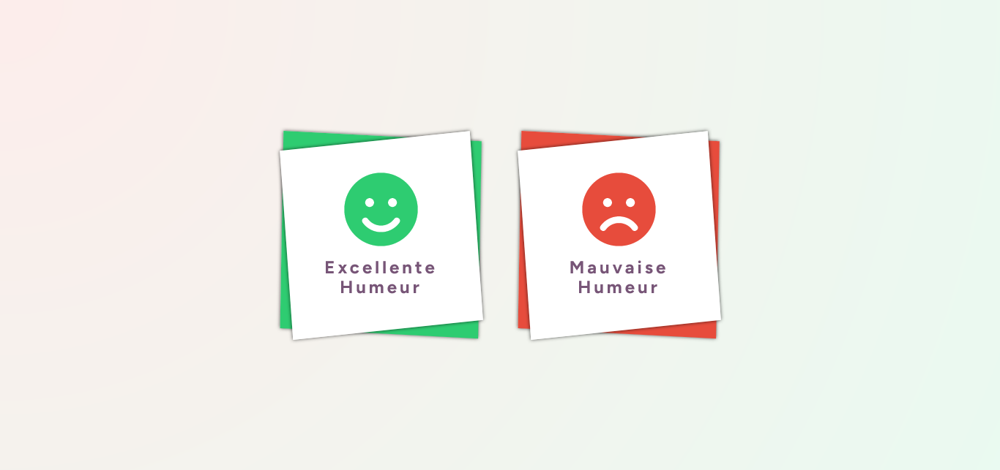

## CARTES D'HUMEUR DESIGN 😊 😈

## Le challenge

Création de cartes d'humeur (avec un travail spécifique sur le design).

## Démonstration

Lien vers le projet : https://aperbet56.github.io/cartes_humeur_design/

## Projet développé avec

- Utilisation des balises sémantiques HTML5
- CSS3
- Flexbox
- Desktop first
- Page web responsive
- Pseudo-éléments
- Position absolute
- Position relative
- Commentaires HTML
- Commentaires CSS
- Utilisation d'un normaliseur : le fichier normalize.css
- Importation de la police "Figtree"
